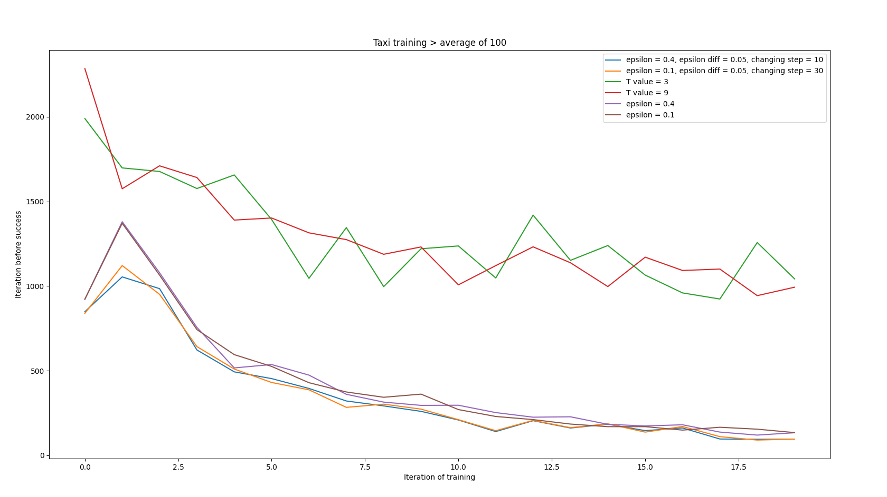
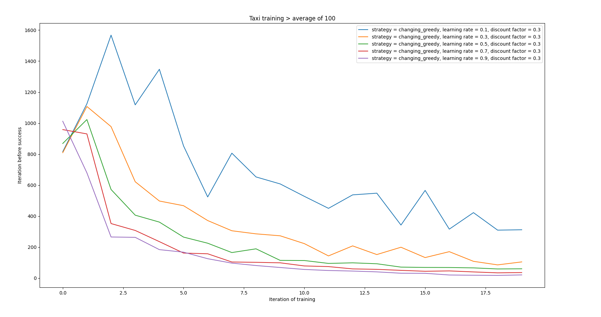
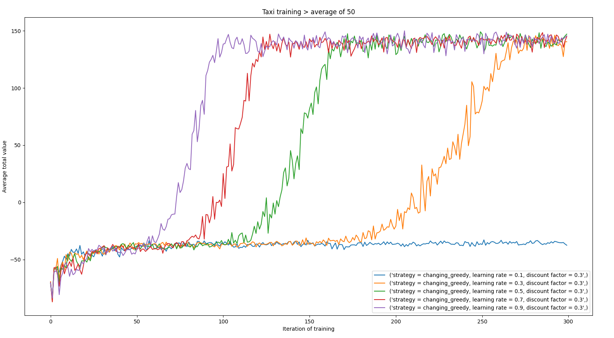

# Q-learning algorithm

## Table of contents
* [General info](#general-info)
* [Technologies](#technologies)
* [Results](#results)
* [Setup](#setup)

## General info
This project is an implementation of rainforcement learning algorithm.

For testinmg I used [gymnasium](https://www.gymlibrary.dev/environments/) environment.

File `test_body.py` contains main loop of the algorithm implemented in a way to be suitable for the enviorement taxt and lunar lander.

File `agent.py` contains agent class which is used to store and change q_learning table.

File `exploration_stategies.py` contains implementation of basic q_learning strategies for exploration.

File `q_learn_test.py` contains functions used to test algorithm on different strategies. It plots an averege of values.

File `q_learning_sprawozdanie.pdf` contains repot of my experiments on this implementation writen in Polish.
	
## Technologies
Project is created with libraries:
* numpy
* dataclasses
* collections
* math
* random

and tested with:
* matplotlib

## Results

### Comparision of few strategies:

### Results on one strategy with diferent parameters:

	
## Setup
To test this algorithm you can either run functions from `test_body.py` file or just simply run `q_learn_test.py` file.